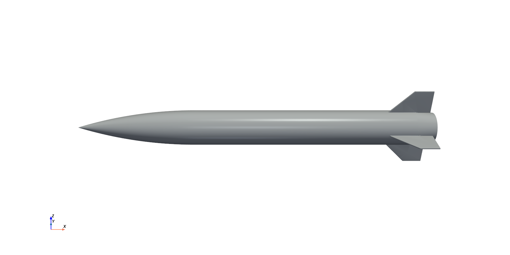

# ntop-suave

**Coupled conceptual design: nTop for geometry, SUAVE for physics, wired into a fixed point.**

SUAVE sizes the vehicle. nTop builds the solid and measures it. The measurements go **back** into
the mass and aerodynamic models, and the loop iterates until the answer stops moving. nTop is not a
downstream renderer here.

The reference example is a solid-propellant rocket vehicle, "SV-1". Its requirements are invented for
the demonstration and correspond to no real programme.

<p align="center">
  
</p>

---

## What is interesting here

**nTop notebooks are authored programmatically.** A `.ntop` file is a binary container, so the
notebook is emitted as recipe JSON and converted with `ntopcl`. Every design variable is a real
notebook input, so one notebook serves every design point: convert once, run many times. See
[docs/REFERENCE.md](docs/REFERENCE.md) for the recipe schema and
[docs/NTOP_NOTES.md](docs/NTOP_NOTES.md) for 24 sections of empirical findings.

**The coupling changes the answer.** On the reference example, feeding nTop's measured geometry back
moved launch mass from 545.1 kg to 554.3 kg and range from 191.6 km to 189.5 km. nTop measured the
enclosed volume to within 0.013 percent of closed form and the cross-section area distribution to
within 0.16 percent at the worst station.

**The loop finds contradictions that inspection misses.** On the reference example it found that two
requirements were mutually exclusive, and that a third was physically impossible for the vehicle
class. Both derivations are in the report.

---

## Quick start

```bash
uv venv --python 3.11 .venv
uv pip install --python .venv/Scripts/python.exe -e ".[dev]"
uv run --python .venv/Scripts/python.exe scripts/bootstrap.py
```

Then prove the pipeline end to end in under a minute:

```bash
.venv/Scripts/python.exe run_sv1.py --stage smoke
```

Then size, trade and report:

```bash
.venv/Scripts/python.exe run_sv1.py --stage size
```

```bash
.venv/Scripts/python.exe run_sv1.py --stage doe --doe-scale full
```

```bash
.venv/Scripts/python.exe -m rocketgen.report.build_report
```

Add `--no-ntop` to any stage to run the physics with analytic geometry and no nTop dependency.

---

## What you need

| | Required for | Notes |
|---|---|---|
| Python 3.11 | everything | 3.12+ untested; SUAVE is old |
| SUAVE 2.5.2 | the physics | fetched by `scripts/bootstrap.py`, LGPL 2.1, not redistributed here |
| nTop Automate (`ntopcl`) | geometry only | licensed separately; set `NTOPCL` if not in the default location |
| nTop block universe | geometry only | located by `scripts/bootstrap.py`; see below |

The aerodynamics, propulsion, trajectory, mass and trade-study modules run with **no nTop
dependency at all.** Only geometry generation needs `ntopcl`.

### The nTop block universe is not in this repository

`ntopgen` needs `functions.json`, `types.json` and `type_defaults.json`, a bulk export of nTop's
block and type API surface. Those files are nTop's, they are specific to one nTop version, and they
are not redistributed here. `scripts/bootstrap.py` finds them on your machine, or you can set
`NTOP_UNIVERSE_DIR`. Run `scripts/bootstrap.py --check` to see what resolved.

---

## Layout

```
rocketgen/
  config.py       the shared contract: DesignVector, Requirements, NtopMeasurements, ...
  ntopgen/        author a notebook, run ntopcl, parse what it measured
  sizing/         atmosphere, aero, propulsion, trajectory, masses, and the coupling loop
  doe.py          factorial and Latin hypercube trade studies
  report/         scripted figures and PDF assembly
tests/            296 tests
examples/SV-1/    the reference result: report PDF, figures, converged design, trade study
docs/             the nTop toolchain record
```

`rocketgen/sizing/loop.py::converge_point` is the coupling. Start there.

---

## Verification

296 tests. The physics is checked against closed form where it exists and against published
measurements where it does not.

| Check | Result |
|---|---|
| Vacuum ballistic range vs closed-form parabola | 2.0e-14 relative |
| Burnout speed vs Tsiolkovsky less gravity loss | 1.7e-13 relative |
| Terminal velocity vs `sqrt(2mg/(rho S CD))` | 8.7e-10 relative |
| Specific-energy drift, 100 s, no thrust or drag | 6.5e-15 relative |
| RK4 order, step halved three times | 15.93, 16.01, 15.76 against 16 |
| Nozzle thrust coefficient vs published isentropic tables | better than 0.1 percent |
| Drag and stability vs 23 Basic Finner free-flight shots | -14.6 percent mean bias on CD0, +2.0 percent on centre of pressure |
| nTop volume of a 25 mm sphere, from `mass_properties` | 0.0104 percent |

The drag bias is systematic and understood. It is corrected by `config.CD0_CALIBRATION`, applied at
the loop boundary and never inside the aero model.

Basic Finner reference: A. D. Dupuis and W. Hathaway, *Aeroballistic Range Tests of the Basic Finner
Reference Projectile at Supersonic Velocities*, DREV-TM-9703, 1997, Table VII.

---

## Reference example: SV-1

Converged with real nTop geometry in the loop. All ten constraints met.

| Quantity | Value | Requirement |
|---|---|---|
| Launch mass | 554.3 kg | <= 1100 kg |
| Range | 189.5 km | >= 185 km |
| Mach at impact | 1.66 | >= 1.50 |
| Maximum dynamic pressure | 195.1 kPa | <= 200 kPa, **active** |
| Body diameter, length | 0.35 m, 3.60 m | <= 0.45 m, <= 4.20 m |

Full write-up, with every limitation and every value that is a guess:
[examples/SV-1/SV1_engineering_report.pdf](examples/SV-1/SV1_engineering_report.pdf), and the organised data set in [examples/SV-1/](examples/SV-1/).

---

## For agents

Read [CLAUDE.md](CLAUDE.md) first. It carries the hard rules, the nTop traps, and the procedure for
adding a new vehicle.

Two rules matter more than the rest. **No invented numbers:** every constant carries a source, and
anything guessed must say `GUESS` in its source string, which tests assert and the report prints.
**Failures are recorded, never swallowed:** the loop degrades to analytic geometry when nTop fails,
but it always says that it did.

---

## Scope

Out of scope by design: CFD, six-degree-of-freedom flight mechanics, guidance law design, structural
sizing beyond wall thickness and a hoop-stress check, and energetics.

The nozzle model is ideal. Real delivered specific impulse for this class runs 3 to 7 percent lower;
that penalty is not applied because its magnitude could not be sourced. It is the largest known
unquantified optimism in the reference result.

---

## Licence

This repository is MIT licensed; see [LICENSE](LICENSE).

SUAVE is LGPL 2.1 and is **not** redistributed here. `scripts/bootstrap.py` fetches it from
[github.com/suavecode/SUAVE](https://github.com/suavecode/SUAVE) into `vendor/`, which is
gitignored. nTop and nTop Automate are commercial products of nTop, licensed separately, and no nTop
software or data is included in this repository.
