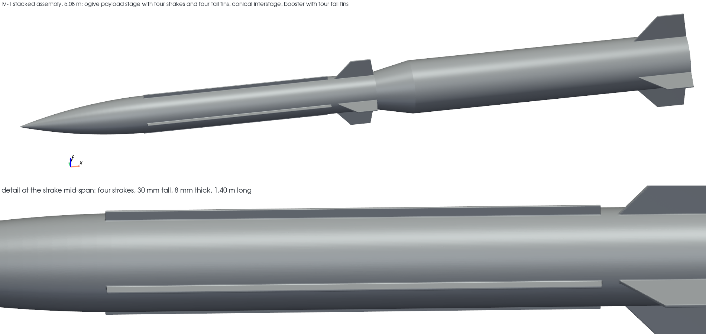

# IV-1 reference example

A two-stage, strake-stabilised vehicle sized to reach 100 statute miles of slant range. The second
reference example for this toolkit, and the one that exercises what a single-body vehicle cannot:
mass that leaves the vehicle mid-flight, an aerodynamic reference area that changes at separation,
and a lifting surface whose load is almost entirely vortex lift.

Read [SPEC_IV1.md](../../SPEC_IV1.md) first. **The requirements are invented for the
demonstration** and correspond to no real programme. Section 2 of that document records the
requirements audit, which is the most useful thing in this example.



## Converged result, with the geometry measured by nTop

| Quantity | Value | Requirement |
|---|---|---|
| Slant range | **160.9 km (100.0 mi)** | >= 100 mi |
| Intercept altitude | 19.9 km | >= 15 km |
| Intercept Mach | 4.00 | >= 3.0 |
| Lateral acceleration available | 15.86 g | >= 15 g |
| Launch mass | **592.2 kg** | <= 1400 kg |
| Stacked length / max diameter | 5.28 m / 0.42 m | <= 5.40 m / 0.42 m |
| Peak dynamic pressure | 311 kPa | <= 350 kPa |
| Grain closure, both stages | 0.37 / 0.89 loading | <= 1.0 |

All sixteen constraints met. 0.42 m booster, 0.34 m payload stage, 220 + 90 kg propellant,
31.3 kg jettisoned at separation, four strakes, conical interstage, 38 kN divert motor.

## The nTop coupling

12.5 percent of the launch mass is nTop-measured: 39.96 kg for the booster airframe and 24.17 kg
for the payload stage with its strakes and fins. The rest is payload, propellant and correlations,
none of which come from geometry.

Feeding the measured geometry back **changed the answer**: launch mass 585.6 kg analytic against
592.2 kg measured, and the intercept moved from 17.6 km to 19.9 km. The measured two-stage airframe
is heavier than the analytic shell estimate.

Measurement accuracy against independent closed-form geometry:

| Body | Volume error | Wetted-area error |
|---|---|---|
| Payload stage | -0.008 % | -0.302 % |
| Booster | -0.002 % | +0.125 % |
| Interstage | +0.000 % | -0.150 % |

Strake wetted area was confirmed three independent ways: area, solid volume, and the cross-section
excess at the strake stations.

## Files

| File | What it is |
|---|---|
| `IV1_engineering_report.pdf` | The write-up. Read this first. |
| `converged.json` | The converged design, all constraints, the mass statement with provenance, and the intercept conditions |
| `geometry/iv1.ntop` | **The parametric nTop notebook.** Every dimension is a real notebook input, so you can open it and change the vehicle. Regenerated with relative export paths, so it carries nothing about the machine that built it. |
| `geometry/iv1_recipe.json` | The recipe JSON the notebook was converted from. This is the human-readable source; `ntopcl convert` turns it into the `.ntop`. |
| `geometry/iv1.stl` | The stacked assembly. GitHub renders this in the browser |
| `geometry/iv1_input.json`, `iv1_output.json` | The `ntopcl` inputs for this design point, and what the notebook returned |
| `geometry/iv1_measurements.json`, `iv1_stages.json` | Per-stage measurements as nTop reported them |
| `iv1_iso.png` | The render above, showing both stages, the strakes and the interstage |
| `trajectory.png` | The ascent, with the staging events marked |
| `aero_iv1_validation.png` | Strake and two-stage aerodynamics, validated against NASA TN D-7921 and TM X-3130 |
| `measurements_*.json` | Per-stage nTop measurements at several design points |

## What the loop caught

Four requirements defects, all found by running the constraint set rather than by inspection:

1. **Three requirements were mutually exclusive.** 15 g of aerodynamic lateral acceleration needs
   dynamic pressure, so it is unavailable above about 14 km at Mach 4, while 100 miles of slant
   range needs an intercept above 20 km. The best point meeting all three was 36.2 miles. Resolved
   by adding a divert motor, which the specification had explicitly excluded; that exclusion was
   the cause.
2. **The dynamic-pressure limit was unachievable.** The floor across the design space is 278 kPa,
   and 309 kPa for anything meeting the range, altitude and Mach requirements.
3. **The tubular-grain assumption is the binding physical limitation on the vehicle.** It capped
   booster thrust near 110 kN, put an area-ratio-10 nozzle exit outside the body, and held stage-2
   propellant to 90 kg. Real tactical motors use finocyl or star grains to escape this.
4. **The constraint list gated grain length-to-diameter but not grain closure**, so a stage-2 grain
   passed at 134 percent volumetric loading with a web wider than the bay radius.

## Reproducing it

```
.venv/Scripts/python.exe scripts/iv1_converge.py --ntop
```

Add nothing for the analytic-geometry run. One nTop measurement call takes 55 to 118 s.
